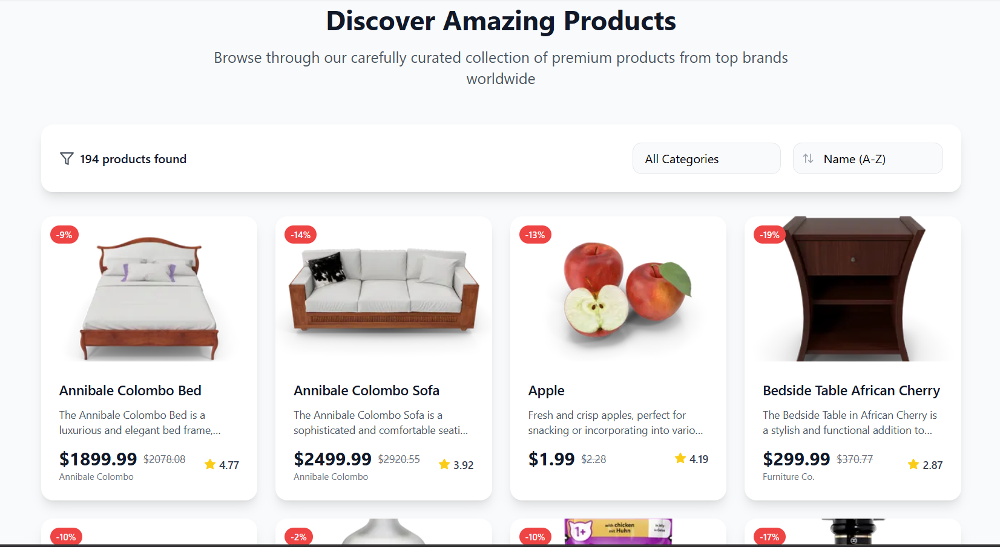
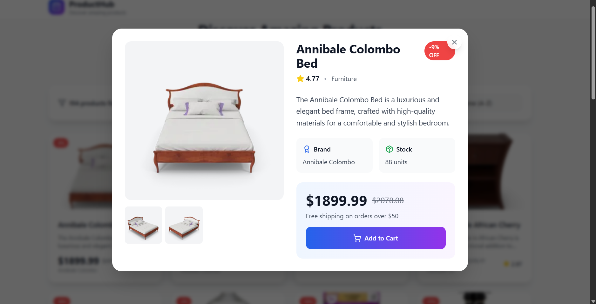
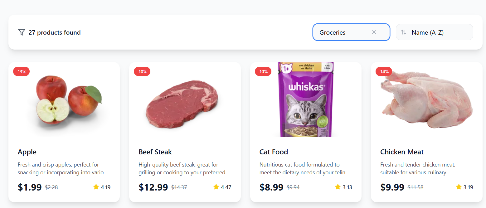

### 🛍️ WinShop

WinShop is a modern e-commerce web application built with React, TypeScript, and Vite. It provides a smooth shopping experience with features like product listing, filtering by categories, sorting, responsive UI, and reusable components.

### 🚀 Features

- 📦 Product Listing – Browse products with grid view layouts.

- 🗂️ Category Filtering – Filter products by category (e.g., Beauty, Furniture, Laptops).

- 🔄 Sorting Options – Sort by price, name (A–Z, Z–A).

- 🎨 Modern UI – Built with Tailwind CSS for responsiveness and clean design.

- ⚡ Fast & Optimized – Powered by Vite + React + TypeScript for lightning-fast builds.

- 🔗 API Integration – Fetches products and categories dynamically from DummyJSON API
.

### 🏗️ Project Structure
```bash
src/
├── components/         # Reusable UI components
│   ├── ErrorState.tsx
│   ├── FilterBar.tsx   # Filters, sorting, and categories
│   ├── Header.tsx
│   ├── LoadingCard.tsx
│   ├── Pagination.tsx
│   ├── ProductCard.tsx
│   └── ProductModal.tsx
│
├── hooks/              # Custom hooks
│   ├── useCategories.ts
│   └── useProducts.ts
│
├── types/              # TypeScript interfaces
│   └── product.ts
│
├── utils/              # API utilities
│   └── api.ts
│
├── App.tsx             # Root component
├── index.css           # Global styles
├── main.tsx            # App entry point
└── vite-env.d.ts
```

### 🛠️ Tech Stack

- Frontend: React, TypeScript, Vite

- UI Styling: Tailwind CSS, Framer Motion, Lucide React (icons)

- State & Hooks: React hooks, custom hooks

- API: DummyJSON (for products and categories)

- Linting & Config: ESLint, PostCSS

### ⚙️ Installation & Setup

- Follow these steps to run the project locally:

1. **Clone the repository**
```bash
git clone https://github.com/Deepanshu8560/WinShop.git
cd WinShop
```

2. **Install dependencies** 
```bash
npm install
```

3. **Run the development server**
```bash
npm run dev
```

4. **Open the app in your browser:**
```bash
http://localhost:5173
```
### 📸 Screenshots

<table>
  <tr>
    <td></td>
    <td></td>
    <td></td>
  </tr>
</table>


### 🤝 Contributing

Contributions are welcome! Feel free to open an issue or pull request.
